  

  
  
  
  
  
  

# Awesome Lakehouse Platform 🏞️⚡

> **The Ultimate Guide to Modern Data Lakehouse Platforms, SaaS Ecosystems, and Open-Source Technologies.** 🚀  
> *Curated insights into Open Table Formats (Apache Iceberg 🧊, Delta Lake 📐, Apache Hudi 🪵), Multi-Engine Query Architectures ⚡, ACID Storage Layers 💾, and SaaS Analytics Platforms ☁️.*

---

## 📌 Executive Overview & Market Intelligence 📊

A **Data Lakehouse** merges the low-cost flexibility and scale of cloud object storage (S3 ☁️, ADLS 💻, GCS 🌐) with the transactional guarantees (ACID 🔒), schema evolution 🧬, and high-speed indexing of traditional data warehouses.

> 📈 **Sector Market Size & Structure**:  
> The global **Cloud Data Lakehouse & Analytics sector** is estimated at **$18.5 Billion in 2026** 💰 (projected to reach **$35+ Billion by 2030** 🚀 at a CAGR of ~25%). The market is **moderately concentrated with winner-take-most dynamics** 🏆, dominated by major cloud hyperscalers and dedicated data platforms (Databricks, Snowflake, Microsoft Fabric, AWS) alongside a growing ecosystem of open-table catalog and query acceleration vendors.

---

## 📑 Table of Contents 📖

- [📌 Executive Overview & Market Intelligence](#-executive-overview--market-intelligence-)
- [☁️ SaaS & Managed Cloud Platforms](#️-saas--managed-cloud-platforms-)
- [🛠️ Open-Source GitHub Projects](#️-open-source-github-projects-)
- [🔄 Open Table Formats Comparison](#-open-table-formats-comparison-)
- [🤝 How to Contribute](#-how-to-contribute-)
- [📈 Star History](#-star-history-)
- [💖 Support & Community](#-support--community-)
- [⚖️ Disclaimer](#️-disclaimer-)

---

## ☁️ SaaS & Managed Cloud Platforms 🏢

*Managed cloud platforms enabling instant deployment, automated scaling, serverless query execution, and enterprise governance.* ✨

| Platform 🚀 | Company Valuation / Revenue 💎 | Key Description 💡 | Starting Pricing Tier 🏷️ | Free Tier / Trial Limits 🎁 | Link 🔗 |
| :--- | :--- | :--- | :--- | :--- | :--- |
| **Microsoft Fabric** 🏢 | ~$3.1 Trillion *(Market Cap)* 👑 | Unified analytics platform with OneLake storage, Delta Lake & Iceberg integration across the Microsoft cloud stack. ☁️ | Starts at **$0.36/hour** *(F2 Capacity, ~$262.80/month pay-as-you-go)* | **60-Day Free Trial** with 64 Capacity Units (F64) & 1TB OneLake storage 🎁 | [Website](https://www.microsoft.com/microsoft-fabric) |
| **AWS Lake Formation** ☁️ | ~$2.1 Trillion *(Market Cap)* 🌟 | Centralized security, governance, and table management service for building and querying AWS data lakes. 🛡️ | **$1.00 per 100k requests** for Glue Catalog; Athena queries at **$5.00/TB** scanned | **Forever Free Tier**: 1 Million Glue Data Catalog requests/month & 1M objects stored 🎉 | [Website](https://aws.amazon.com/lake-formation/) |
| **Snowflake** ❄️ | ~$45 Billion *(Market Cap)* ⚡ | Cloud Data Platform featuring native Apache Iceberg table support, external catalogs, and multi-cloud analytics. 🌐 | Standard Edition starts at **$2.00 per Snowflake Credit** *(AWS US-East)* | **30-Day Free Trial** with **$400** in free usage credits 💳 | [Website](https://www.snowflake.com/) |
| **Databricks** 🧱 | ~$43 Billion *(Valuation)* 🔥 | Premier lakehouse platform unifying data engineering, AI/ML, and SQL analytics on Delta Lake & Iceberg via Photon engine. 🧠 | Standard Compute starts at **$0.07 per DBU** *(Data Intelligence Platform / AWS)* | **14-Day Free Trial** with full platform feature access on AWS/Azure/GCP ⚡ | [Website](https://www.databricks.com/) |
| **Cloudera Data Platform** 🐘 | ~$5.3 Billion *(Enterprise Valuation)* 🏦 | Enterprise data cloud platform supporting hybrid/multi-cloud lakehouses, Apache Iceberg, and lineage management. 🔒 | CDP Cloud compute starts at **$0.36 per CCU** *(Cloudera Compute Unit)/hour* | **60-Day Free Trial** on AWS/Azure with **$1,000** cloud credit grant 💵 | [Website](https://www.cloudera.com/) |
| **Starburst Galaxy** 🌌 | ~$3.3 Billion *(Valuation)* ⭐ | Managed Trino-based query platform delivering cross-cloud federated and lakehouse SQL analytics without infrastructure overhead. ⚡ | Galaxy Standard Cluster starts at **$0.40 per Starburst Credit/hour** | **14-Day Free Trial** with **$500** in free usage credits 🎁 | [Website](https://www.starburst.io/) |
| **Firebolt** ⚡ | ~$1.4 Billion *(Valuation)* 🎯 | Cloud data warehouse delivering sub-second interactive analytics over object storage and lakehouse table structures. 🚀 | Compute engine starting at **$0.18 per FBU** *(Firebolt Unit)/hour* | **30-Day Free Trial** with **$200** in free usage credits 💳 | [Website](https://www.firebolt.io/) |
| **Dremio Cloud** 🎯 | ~$1.0 Billion *(Valuation)* 🔍 | Apache Iceberg-focused lakehouse SQL query engine and autonomous catalog service. 🧊 | Enterprise edition starts at **$0.39 per DCU** *(Dremio Control Unit)/hour* | **Forever Free Standard Edition** *(0 DCU software fee)*; 14-Day Enterprise Trial 🎉 | [Website](https://www.dremio.com/) |
| **Onehouse** 🏠 | ~$100 Million *(Valuation)* 📦 | Fully managed lakehouse platform powered by Apache Hudi and Onetable for universal open table format interop. 🔄 | Managed ingestion & transformation starting at **$0.15 per vCPU hour** | **30-Day Free Trial** with **1,000** free ingestion unit credits 🎁 | [Website](https://www.onehouse.ai/) |
| **Upsolver** ⚙️ | ~$80 Million *(Valuation)* 🛠️ | Continuous data ingestion & transformation engine automatically outputting analytics-ready Iceberg tables on object storage. 🔄 | Pipeline compute starting at **$0.09 per compute unit hour** | **Forever Free Developer Tier** *(100 credits/month)*; 14-Day Enterprise Trial 🎉 | [Website](https://www.upsolver.com/) |

---

## 🛠️ Open-Source GitHub Projects 🌟

*Leading open-source software powering vendor-neutral, multi-engine lakehouse architectures. Sorted by GitHub community stargazers.* ⭐

- **[MinIO](https://github.com/minio/minio)**  📦  
  High-performance S3-compatible object storage server built for private cloud and Kubernetes lakehouse infrastructure.

- **[Apache Airflow](https://github.com/apache/airflow)**  🌪️  
  Programmatic workflow orchestration platform to author, schedule, and monitor complex lakehouse ETL/ELT data pipelines.

- **[Apache Spark](https://github.com/apache/spark)**  ⚡  
  Unified analytics processing engine for large-scale data computing—the core execution engine behind most lakehouses.

- **[DuckDB](https://github.com/duckdb/duckdb)**  🦆  
  In-process analytical SQL database engine optimized for fast local queries on Parquet, Iceberg, and Delta Lake files.

- **[Apache Flink](https://github.com/apache/flink)**  🐿️  
  Stateful stream processing framework widely used for real-time CDC ingestion and low-latency updates into open table formats.

- **[Cube](https://github.com/cube-js/cube)**  🧊  
  Universal semantic layer for AI applications and data analytics teams building consistent metrics over lakehouse query engines.

- **[Apache Arrow](https://github.com/apache/arrow)**  🏹  
  In-memory columnar data platform enabling high-speed zero-copy data transport between lakehouse compute engines.

- **[dbt Core](https://github.com/dbt-labs/dbt-core)**  🟧  
  SQL-first data transformation workflow enabling engineers to transform, model, and test data in-place inside data lakehouses.

- **[Trino](https://github.com/trinodb/trino)**  🐰  
  Fast distributed SQL query engine designed for interactive analytics across open table formats and federated data sources.

- **[Apache DataFusion](https://github.com/apache/datafusion)**  🦀  
  Extensible Rust-native SQL query engine and query planner for building custom high-performance data processing tools.

- **[Apache Iceberg](https://github.com/apache/iceberg)**  🧊  
  Open table format for giant analytical datasets featuring ACID transactions, schema evolution, time travel, and multi-engine support.

- **[Delta Lake](https://github.com/delta-io/delta)**  📐  
  Open storage layer providing ACID transactions, scalable metadata handling, and batch/streaming convergence for data lakes.

- **[Apache Hudi](https://github.com/apache/hudi)**  🪵  
  Streaming data lakehouse table format optimized for fast upserts, incremental processing pipelines, and CDC ingestion.

- **[lakeFS](https://github.com/treeverse/lakeFS)**  🌿  
  Git-like version control engine for object storage, bringing branching, committing, and rollback capabilities to lakehouses.

- **[Apache Gravitino](https://github.com/apache/gravitino)**  🌌  
  High-performance federated metadata catalog for managing unified data assets across multi-cloud lakehouse environments.

- **[Apache Polaris](https://github.com/apache/polaris)**  🐻  
  Open-source Apache Iceberg REST catalog delivering centralized multi-engine access control, RBAC, and governance.

---

## 🔄 Open Table Formats Comparison 📊

| Feature ⚙️ | Apache Iceberg 🧊 | Delta Lake 📐 | Apache Hudi 🪵 |
| :--- | :--- | :--- | :--- |
| **Primary Creator** 🏗️ | Netflix / Tabular | Databricks | Uber |
| **Governance** 🏛️ | Apache Software Foundation | Linux Foundation | Apache Software Foundation |
| **Key Strengths** 🎯 | Engine independence, partition evolution, hidden partitioning | Spark integration, UniForm interop, liquid clustering | Incremental pipelines, low-latency upserts, streaming CDC |
| **Query Engine Ecosystem** ⚡ | Spark, Trino, Flink, Starburst, Dremio, Snowflake | Spark, Trino, Presto, DataFusion | Spark, Trino, Flink, Presto |

---

## 🤝 How to Contribute 💡

1. 🔀 **Fork** this repository.
2. ✏️ Add or update entries in `README.md` maintaining the existing structure (Table format for SaaS, bullet + star badge for Open Source).
3. 📋 Ensure descriptions are factual, link directly to official repositories/websites, and specify pricing/tier details.
4. 🚀 Open a **Pull Request** with a clear explanation of your additions.

---

## 📈 Star History ⭐

---

## 💖 Support & Community 🤝

Thank you for visiting **Awesome Lakehouse Platform**! 🙏  

If you find this repository helpful for your data engineering work, analytics stack design, or technical research, please consider supporting the project:

- 🌟 **Star this repository** to help others discover it.
- 🔀 **Fork & Contribute** your favorite lakehouse engines, tools, or updates.
- 📢 **Share** with your network, team, or data engineering communities.
- ☕ **Sponsor the Maintainer**: If you'd like to buy a coffee or sponsor ongoing maintenance, visit the [GitHub Sponsor Dashboard](https://github.com/sponsors/ishandutta2007).

  

---

## ⚖️ Disclaimer 🛡️

*This repository is community-curated for informational purposes. Product pricing, free trial limits, and valuation metrics are based on publicly available documentation and market records as of 2026. Trade names and trademarks belong to their respective owners.*

---

  <b>Built with ❤️ for Data Engineers, Analytics Architects, and Data Platform Leaders worldwide.</b>

